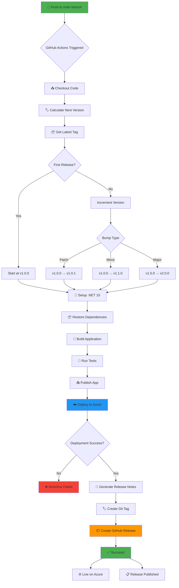
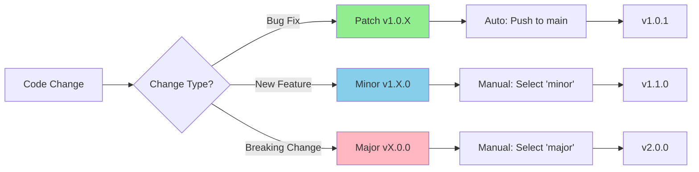
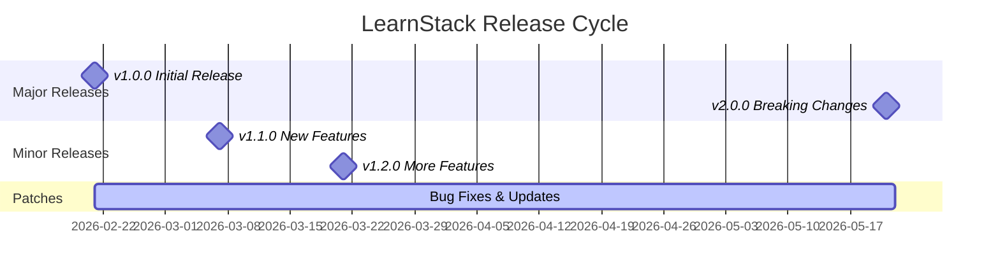
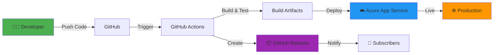
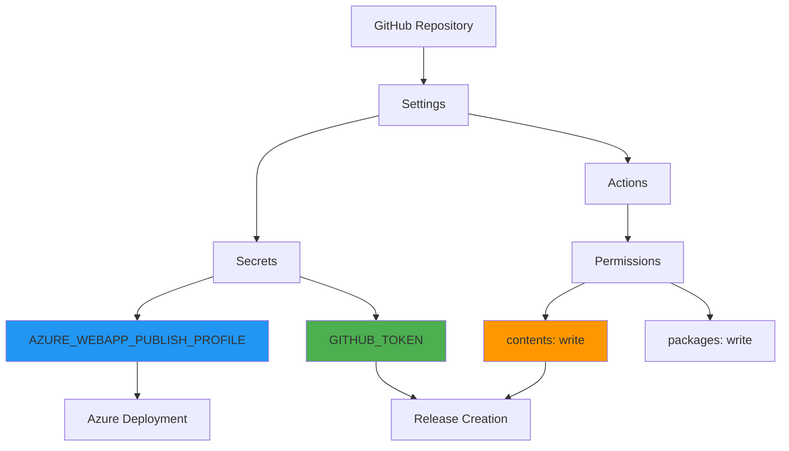

# 🔄 CI/CD Pipeline Overview

## Deployment & Release Flow



## Workflow Stages

### 1. 🎯 Trigger
- **Automatic**: Push to `main` branch
- **Manual**: Workflow dispatch with version bump selection

### 2. 🏷️ Versioning
```
Latest Tag: v1.2.3
Bump Type: patch
New Version: v1.2.4
```

### 3. 🔨 Build
```bash
dotnet restore → dotnet build → dotnet test → dotnet publish
```

### 4. 🚀 Deploy
```
Artifact → Azure App Service → Production Environment
```

### 5. 📦 Release
```
Create Tag → Generate Notes → Publish Release → Notify
```

## Version Decision Tree



## Timeline Example

```
Day 1: v1.0.0 - Initial Release
       └─ feat: Initial app with auth & resources
       
Day 2: v1.0.1 - Patch
       └─ fix: Login redirect issue
       
Day 5: v1.0.2 - Patch
       └─ fix: UI alignment bugs
       
Week 2: v1.1.0 - Minor
        └─ feat: Add export functionality
        └─ feat: Dark mode support
        
Week 3: v1.1.1 - Patch
        └─ fix: Export CSV formatting
        
Month 2: v2.0.0 - Major
         └─ BREAKING: New API structure
         └─ feat: Mobile responsive redesign
         └─ feat: Real-time collaboration
```

## Release Timeline



## Environment Flow



## Permissions & Secrets



## Success Metrics

After each deployment, you get:

| Metric | Description |
|--------|-------------|
| ✅ Build Status | Pass/Fail status of the build |
| ⏱️ Build Time | Total time from trigger to completion |
| 📦 Artifact Size | Size of the published application |
| 🏷️ Version Tag | New semantic version created |
| 🌐 Deployment URL | Live application endpoint |
| 📋 Release Notes | Auto-generated changelog |

## Monitoring

Track your deployments:

1. **GitHub Actions**: [Actions Tab](../../actions)
2. **Releases**: [Releases Page](../../releases)
3. **Azure Portal**: App Service → Deployment Center
4. **Application Insights**: Azure → App Service → Application Insights

---

## Quick Reference

### Manual Deployment Commands

```bash
# Trigger from Actions tab, or:
gh workflow run azure-app-service.yml -f version_bump=patch
gh workflow run azure-app-service.yml -f version_bump=minor
gh workflow run azure-app-service.yml -f version_bump=major
```

### Check Latest Version

```bash
git describe --tags --abbrev=0
```

### View All Releases

```bash
gh release list
```

---

*Powered by GitHub Actions · Deployed to Azure App Service*
