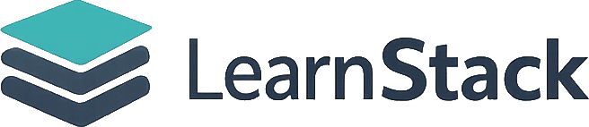

<div align="center">



Blazor Server application for organizing learning resources, turning them into content ideas, and sharing curated knowledge with other learners.

[](https://github.com/kasuken/LearnStack/actions/workflows/azure-app-service.yml)


[Overview](#overview) • [Features](#features) • [Getting started](#getting-started) • [Configuration](#configuration) • [Deployment](#deployment) • [Project structure](#project-structure)

</div>

## Overview

LearnStack helps learners and creators manage the full path from discovery to publishing:

- Save articles, videos, podcasts, courses, and documentation in one place.
- Track progress, priorities, notes, and archived items.
- Turn saved material into structured content ideas.
- Share public collections and selected resources with other users.
- Use the app in multiple languages with light and dark themes.

The application is built with ASP.NET Core, Blazor Server, Entity Framework Core, SQL Server, MudBlazor, and ASP.NET Identity.

## Features

### Learning resource management

- Capture resources by URL with automatic metadata enrichment.
- Organize items by type, status, priority, tags, and notes.
- Switch between list and table views, search, filter, archive, and export your library.
- Track progress across to-learn, in-progress, completed, and archived states.

### Content idea workflow

- Create content ideas from your learning backlog.
- Link ideas back to the source resources that inspired them.
- Track ideas from draft to published.

### Sharing and collaboration

- Create public shared collections with unique share links.
- Manage friendships with invitation links.
- Share selected public resources with connected friends.

### Product experience

- Localized UI in English, German, Spanish, French, and Italian.
- Light and dark theme support.
- ASP.NET Identity authentication with passkey support.
- Terms of Service acceptance flow for signed-in users.

### Platform and deployment

- SQL Server persistence through Entity Framework Core.
- Automatic database migration on application startup.
- Azure App Service deployment workflow with semantic version tagging and GitHub releases.

## Tech stack

- .NET 10 / ASP.NET Core / Blazor Server
- Entity Framework Core 10 with SQL Server
- ASP.NET Core Identity
- MudBlazor
- HtmlAgilityPack for metadata scraping
- GitHub Actions for CI/CD and release automation

## Getting Started

### Prerequisites

- .NET 10 SDK
- SQL Server or SQL Server LocalDB
- Git

> [!NOTE]
> The default development configuration uses SQL Server LocalDB on Windows. If you prefer SQL Server, Azure SQL, or a containerized database, override `ConnectionStrings__DefaultConnection` before starting the app.

### Run locally

```bash
git clone https://github.com/kasuken/LearnStack.git
cd LearnStack
dotnet restore LearnStack.sln
dotnet run --project LearnStack/LearnStack.csproj
```

Open the HTTPS URL printed in the console and register a new account.

> [!IMPORTANT]
> The application applies pending Entity Framework migrations automatically on startup. Point the connection string at a database you are comfortable initializing before first run.

### Build the solution

```bash
dotnet build LearnStack.sln
```

## Configuration

The main application settings live in `LearnStack/appsettings.json` and `LearnStack/appsettings.Development.json`.

### Required settings

- `ConnectionStrings:DefaultConnection`: SQL Server connection string used by Entity Framework Core and ASP.NET Identity.

Example environment variable override:

```powershell
$env:ConnectionStrings__DefaultConnection="Server=tcp:your-server.database.windows.net,1433;Initial Catalog=LearnStackDb;Persist Security Info=False;User ID=your-user;Password=your-password;MultipleActiveResultSets=False;Encrypt=True;TrustServerCertificate=False;Connection Timeout=30;"
```

### Runtime behavior

- Database access is created through `IDbContextFactory<ApplicationDbContext>`.
- Supported UI cultures are `en`, `de`, `es`, `fr`, and `it`.
- Request localization uses cookie selection first, then the `Accept-Language` header.
- Open Graph metadata fetching uses a dedicated HTTP client and includes YouTube oEmbed support.

## Deployment

LearnStack includes a GitHub Actions workflow that deploys the app to Azure App Service whenever changes are pushed to `main`.

The workflow:

- builds and publishes the Blazor application,
- deploys it to Azure App Service,
- calculates the next semantic version,
- creates a Git tag,
- publishes a GitHub release.

Useful docs:

- [Azure deployment guide](./.github/DEPLOYMENT.md)
- [Release and versioning guide](./.github/RELEASES.md)

> [!TIP]
> The workflow is configured for the `learnstack-prod-001` Azure Web App name by default. If you fork the repository, update `.github/workflows/azure-app-service.yml` and the `AZURE_WEBAPP_PUBLISH_PROFILE` secret for your own environment.

## Project structure

```text
.
|- LearnStack.sln
|- LearnStack/
|  |- Components/
|  |  |- Marketing/       # Public landing pages
|  |  |- Pages/           # Authenticated application pages
|  |  |- Shared/          # Reusable forms, cards, dialogs, selectors
|  |- Controllers/        # MVC endpoints such as culture switching
|  |- Data/               # DbContext, identity user, models, migrations
|  |- Resources/          # Localization resource files
|  |- Services/           # Application services and metadata fetching
|  |- wwwroot/            # Static assets, styles, scripts, logos, ToS page
|- .github/
|  |- workflows/          # Azure deployment and release automation
|  |- DEPLOYMENT.md
|  |- RELEASES.md
```

## What the app covers today

- Personal learning resource library
- Content idea planning pipeline
- Shared collections by link
- Friend invitations and public resource sharing
- Localization and theme support
- Azure deployment automation

If you want to extend the project, the most natural next areas are richer collaboration, analytics, and smarter idea generation from saved resources.

